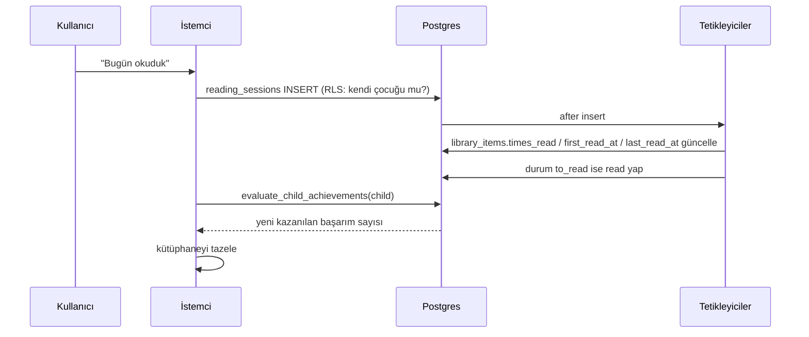
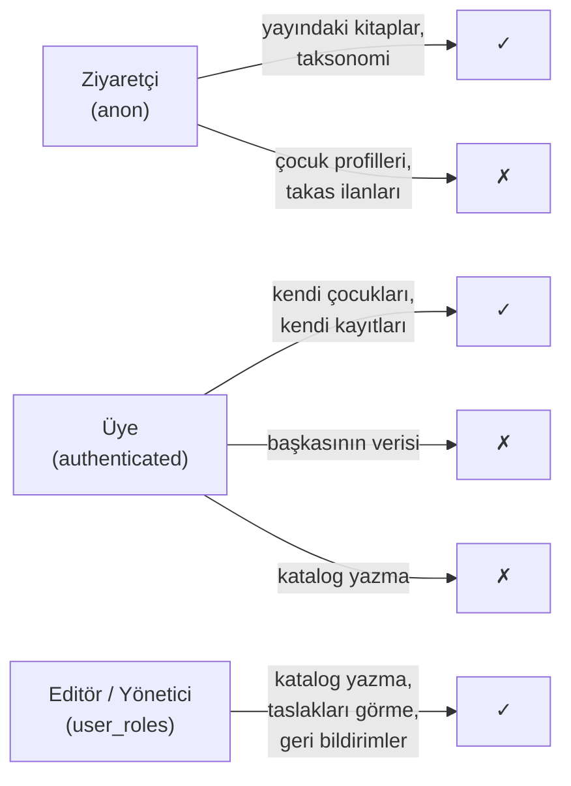
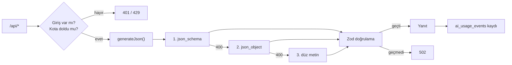

# Mimari

**Son güncelleme:** 2026-09-22 · İlgili kararlar: [ADR 0001](decisions/0001-next-supabase.md),
[ADR 0003](decisions/0003-yapay-zeka-saglayicisi.md), [ADR 0008](decisions/0008-veritabani-dogru-kaynak.md),
[ADR 0009](decisions/0009-kapak-depolama.md)

---

## 1. Genel görünüm

```mermaid
flowchart TB
    subgraph repo["Depo (git)"]
        content["content/*.json<br/>yedek + tohum"]
        migrations["supabase/migrations/*.sql"]
        bookadd["npm run book:add<br/>(Claude, yerelde)"]
    end

    subgraph vercel["Vercel"]
        rsc["Sunucu bileşenleri<br/>katalog · kitap sayfası · yönetim"]
        client["İstemci bileşenleri<br/>filtreler · kütüphane · formlar"]
        api["API uçları<br/>/api/kapak-tani · /api/rapor-yorumu · /api/oneri"]
        admin["Yönetim<br/>sunucu eylemleri · /api/yonetim/kapak (sharp)"]
        mw["Middleware<br/>oturum tazeleme · rota koruması"]
    end

    subgraph supabase["Supabase"]
        auth["Auth"]
        db[("Postgres<br/>RLS her tabloda")]
        storage["Storage<br/>kapaklar: büyük + küçük WebP"]
    end

    ai["OpenAI uyumlu sağlayıcı<br/>(OpenRouter)"]

    content -->|db:seed (yalnızca eksikler)| db
    db -->|db:export| content
    bookadd -->|upsert_book, tek işlem| db
    bookadd -->|gizli anahtar| storage
    admin -->|upsert_book, editör oturumu| db
    admin -->|editör oturumu| storage
    migrations -->|elle / CLI| db
    rsc -->|anon istemci, önbellekli| db
    client -->|kullanıcı oturumu, RLS| db
    client --> storage
    mw --> auth
    api --> ai
    api --> db
```

## 2. Katmanlar

| Katman        | Yer                                                      | Sorumluluk                                                |
| ------------- | -------------------------------------------------------- | --------------------------------------------------------- |
| Sayfalar      | `src/app`                                                | Yönlendirme, sunucuda veri çekme, metadata                |
| Bileşenler    | `src/components`                                         | Arayüz; iş mantığı barındırmaz                            |
| Veri erişimi  | `src/lib/data`                                           | Tüm Supabase sorguları burada; satır → alan tipi dönüşümü |
| İş mantığı    | `src/lib` (filters, stats, recommendations, age, search) | Saf fonksiyonlar, testli, React'ten bağımsız              |
| Yapay zekâ    | `src/lib/ai`                                             | Sağlayıcıdan bağımsız istemci, şema doğrulamalı yanıt     |
| İçerik        | `content/` + `src/lib/content`                           | Katalogun yedeği ve tohumu, şemaları (ADR 0008)           |
| Kitap girdisi | `src/lib/books`, `src/lib/images`                        | Form ile betiğin ortak doğrulaması; kapak işleme (sharp)  |
| Şema          | `supabase/migrations`                                    | Tablolar, RLS, tetikleyiciler, görünümler                 |

**Kural:** bileşenler doğrudan Supabase çağırmaz, `src/lib/data` üzerinden geçer.
Tek istisna basit formlardır (geri bildirim, bağış); onlar tek bir `insert`
yaptıkları için ara katman gereksiz karmaşıklık olurdu.

## 3. Veri akışı: katalog

```mermaid
sequenceDiagram
    participant E as Editör / Claude
    participant Y as Yönetim formu / book:add
    participant DB as Supabase
    participant N as Next.js
    participant K as Kullanıcı

    E->>Y: kitap bilgileri (tek ya da liste)
    Y->>Y: ortak şemayla doğrulama (src/lib/books/input.ts)
    Y->>DB: upsert_book() — ilişkiler + otomatik etiketleme
    Y->>DB: kapak → sharp → Storage (büyük + küçük WebP)
    Y->>N: revalidateTag('catalog') (yalnızca form; betik 5 dk bekler)
    K->>N: ana sayfa isteği
    N->>DB: catalog_books görünümü (anon, önbellekli 5 dk)
    DB-->>N: ~200 satır kompakt izdüşüm
    N-->>K: sunucuda render + istemciye veri
    K->>K: arama ve filtreleme (ağ isteği yok)
```

Ana sayfa kataloğun tamamını bir kez alır; filtreleme ve arama istemcide
çalışır. Bu, v1'deki "anında tepki" hissini korur ama veri artık depoya gömülü
değil, veritabanından gelir ve önbelleklenir.

Kartlar küçük kapağı (`coverThumbUrl`, ≤480 px), kitap sayfası büyük kapağı
(`coverUrl`, ≤1350 px) kullanır. Dosya adları içeriğin özeti olduğu için bir
yıl önbellekte kalabilirler (ADR 0009).

### Yönetim yazmaları

| Ne                   | Yol                                                                       |
| -------------------- | ------------------------------------------------------------------------- |
| Kitap                | `BookForm` → `saveBookAction` → `saveBook` → `upsert_book()`              |
| Kapak                | `CoverUpload` → `POST /api/yonetim/kapak` → `storeCover` + `setBookCover` |
| Rehber / konu / ilgi | `TaxonomyEditor` → sunucu eylemi → tablo (personel RLS)                   |
| Keşif modu           | `ModeEditor` → `saveModeAction` → `save_discovery_mode()`                 |

Sunucu eylemleri `src/app/yonetim/actions.ts` içinde; sorgular
`src/lib/data/admin.ts` ve `src/lib/data/covers.ts` içinde. Her yönetim
sayfası `requireStaff()` ile başlar: Next.js yerleşimi ve sayfayı aynı anda
çalıştırdığı için yerleşimdeki kontrol sayfanın sorgularını durdurmuyor.

## 4. Veri akışı: okuma kaydı



Türetilmiş alanlar uygulamada değil veritabanında hesaplanır; iki farklı
istemci aynı veriyi farklı türetemez.

## 5. Kimlik ve yetki



- Oturum çerezi `src/middleware.ts` tarafından her istekte tazelenir.
- Korumalı adresler middleware'de listelidir; yönetim sayfası ayrıca sunucuda
  rol kontrolü yapar.
- Yetki asıl olarak **veritabanında** uygulanır (RLS). Arayüzdeki kontroller
  yalnızca kullanıcı deneyimi içindir.

## 6. Önbellekleme

| Veri             | Yöntem                                                       | Süre   |
| ---------------- | ------------------------------------------------------------ | ------ |
| Katalog listesi  | `unstable_cache` + `catalog` etiketi                         | 5 dk   |
| Taksonomi        | `unstable_cache` + `catalog` etiketi                         | 5 dk   |
| Kitap sayfası    | `unstable_cache` + `book:<slug>` etiketi, sayfa `revalidate` | 1 saat |
| Bağış kurumları  | sayfa `revalidate`                                           | 1 saat |
| Kullanıcı verisi | önbelleklenmez                                               | —      |

Taksonomi okuması kök yerleşimde olduğu için hatası yutulur: veritabanı
erişilemezse rehber menüsü boş görünür ama giriş sayfası dahil site ayakta
kalır.

## 7. Yapay zekâ katmanı



Anahtar yalnızca sunucuda; kota veritabanından hesaplanır (sunucusuz ortamda
bellekte tutulamaz).

## 8. Bilinçli tercihler ve bilinen sınırlar

- **Kök `loading.tsx` yok.** Suspense sınırı, akış başladıktan sonra oluşan
  hataların durum kodunu 200'e sabitliyor; bu `notFound()` çağrılarını "yumuşak
  404"e çeviriyordu. İskelet yalnızca `(catalog)` rota grubunda.
- **Katalog istemciye gönderiliyor** (~60 KB). Anında filtreleme için bilinçli
  tercih. Katalog birkaç bine çıkarsa sunucu tarafı aramaya geçilmeli
  (altyapı hazır: `books.search_vector` + `build_search_query`).
- **Yazar bilgisi çoğu kitapta yok.** Kaynak Instagram tanıtımlarında yazar
  adı yapılandırılmış biçimde bulunmuyordu. Şema hazır; veri zamanla girilecek.
- **Tek bölge.** Supabase ve Vercel Avrupa'da; Türkiye'den gecikme kabul
  edilebilir düzeyde.
